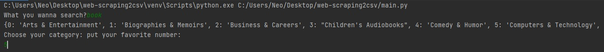
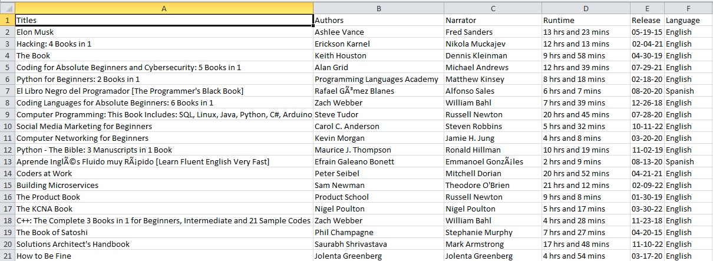

# Custom Web Scraper, Python

* Some portfolio attachment that I've worked ago along on Upwork. Idea is to collect information 
  and store it into csv file.

* Website that gave me some inspiration:

  [Web Page to scrape Example](https://www.audible.com/)

### Requirements

##### Beautiful Soup Library:

[bs4 docs](https://beautiful-soup-4.readthedocs.io/en/latest/)

##### Requests Library:

[Requests docs](https://requests.readthedocs.io/en/latest/)

##### CSV Library:

[CSV docs](https://docs.python.org/3/library/csv.html)

### Usage

* When we run our scraper, we have inputs to choose. First input was search area, what we want to look for. 
  In our case we check *books*. Then we have another prompt which asks us for category that have dictionary 
  with keys of numbers and value is name of specific category. We look dictionary and type choosen number.
  

* After we press enter, script automatically take inputs and scrape particular data and store it into CSV file:

    
### Ideas for future improvements

##### This project as any other have always space for improvements.
    I use a lot ideas to practice and upgrade my skills.
    
* Scrape more pages with same data.
* OOP version with classes and methods to use objects for easier manipulation to avoid code 'mess'.
* Same data have different css elements for some reason, so we need to add exception and can add alternative not just 
  passing like I was :)
  
* Instead of CSV file, we can build the web page in Flask, styling with html/css/bootstrap and show our scraped data,
  for better UI & UE 